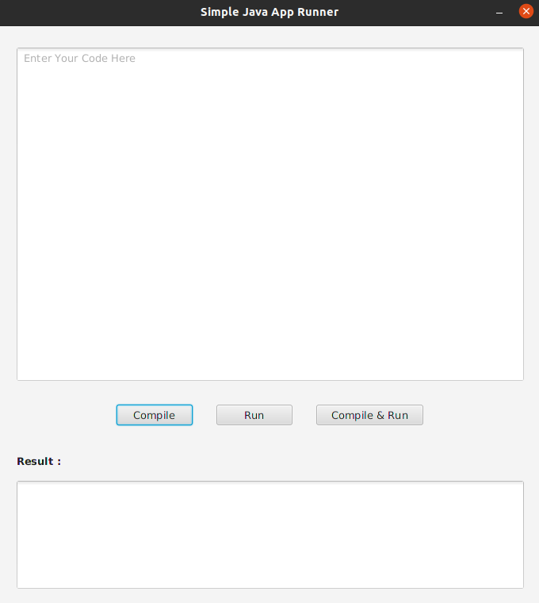

# Simple Java App Runner

### The Repository
I developed this Java App Runner to get more practical knowledge of using processes.
The source code is available to everyone under the standard [MIT License](https://choosealicense.com/licenses/mit/).

### Simple Java App Runner

### License
Copyright © 2022 -  B G Thakshila Nuwangi. All rights reserved.

Licensed under the [MIT License](https://choosealicense.com/licenses/mit/)